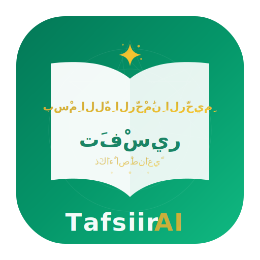

<div align="center">
  

  # Caawiyaha Tafsiirka Af-Soomaaliga

  > **Kaaliye AI ah oo xawaare sare leh, looguna talagalay Tafsiirka Qur'aanka ee Af-Soomaaliga.**

  [](https://nextjs.org/)
  [](https://aistudio.google.com/)
  [](https://memvid.com)
  [](LICENSE)
</div>

Kani waa kaaliye AI ah oo ku hadla Af-Soomaali, kaas oo bixiya jawaabo suubban oo sax ah oo laga soo xigtay Tafsiirka Qur'aanka. Waxaa loo dhisay bulshada Soomaaliyeed ee daneeya AI si aqoonta diintu ay u noqoto mid si fudud lagu heli karo iyadoo la adeegsanayo tignoolajiyada casriga ah.

---

## 📖 Keydka Aqoonta & Taageerada

### 🧠 Xusuusta Moodelka
Caqliga kaaliyahan wuxuu ku qotomaa faylka `data/trained.json`. Xogtan (dataset) waxay u adeegtaa ilaha koowaad ee lagu dhisay xusuusta kaaliyaha (semantic memory), si loo xaqiijiyo in jawaab kasta laga soo xigtay Tafsiir Af-Soomaali ah oo la aqoonsan yahay.

### 🎯 Baaxadda Taageerada
*   **Xoogga Kaaliyaha AI**: Waxaa lagu habeeyay (optimized) **Suuradda Al-Faatixa** iyo **Juz-ka 30aad (Camma)**.
*   **Awoodda Nidaamka**: In kasta oo AI-gu hadda ku kooban yahay qaybahaas, qaabdhismeedka iyo **API-ga nidaamku wuxuu taageeraa dhammaan 114-ka Suuradood ee Qur'aanka Kariimka ah**. Waxaad si fudud u ballaarin kartaa xusuusta kaaliyaha si uu u koobo Qur'aanka oo dhan.

---

## ✨ Tilmaamaha Muhiimka ah

- **🎯 Saxnaanta Macnaha**: Waxay isticmaashaa `gemini-embedding-001` si ay u fahanto duruufaha diimeed ee qotada dheer iyo nuxurka Af-Soomaaliga.
- **⚡ Raadinta Isku-dhafka ah**: Waxay ku dhex milantay **[Memvid](https://memvid.com)** si loo helo isku-darka awoodda raadinta vector-ka iyo keyword-ka, taas oo xaqiijinaysa in aayadaha loo soo saaro si sax ah.
- **🛡️ Jawaabo Sugan**: Waxay si adag ugu xidhan tahay xogta tafsiirka ee la siiyay. Haddii macluumaadku uusan ku jirin keydka, kaaliyahu ma curinayo jawaab aan jirin.
- **📱 Khibrad Casri ah**: Interface qurux badan oo leh muuqaal Islaami ah, animations fudud, iyo taageerada "dark mode".

---

## 🛠 Tignoolajiyada

- **Laf-dhabarta**: [Next.js 15](https://nextjs.org/) (App Router, React 19)
- **Naqshadda (CSS)**: [Tailwind CSS 4](https://tailwindcss.com/)
- **Xusuusta Vector-ka**: [@memvid/sdk](https://www.npmjs.com/package/@memvid/sdk) (Keydka `.mv2` ee maxalliga ah)
- **Caqliga AI**: [Google Gemini 2.0 Flash](https://aistudio.google.com/)
- **Isha Xogta**: Tafsiirka Af-Soomaaliga ee JSON (`data/trained.json`)

---

## 📁 Qaabdhismeedka Mashruuca

```bash
├── data/           # Isha xusuusta moodelka (trained.json) & Memvid DB
├── src/
│   ├── app/        # API-ga wada-hadalka iyo marinada (routes)
│   └── components/ # Qaybaha UI (Sidebarka, Farriimaha, iwm.)
├── scripts/        # Qalabka aqoonta lagu shubo (ingestion)
└── public/         # Sawirada iyo astaamaha diimeed
```

---

## ⚙️ Sida loo Bilaabo

### 1. Shuruudaha Hormariska ah
- Node.js 18+
- [Google Gemini API Key](https://aistudio.google.com/)

### 2. Dejinta
```bash
git clone https://github.com/your-repo/tafsiir-agent.git
cd tafsiir-agent
npm install
```

### 3. Deegaanka (Environment)
Samee fayl `.env` oo ku yaal xididka mashruuca:
```env
GOOGLE_API_KEY=your_gemini_api_key_here
```

### 4. Dhisidda Xusuusta
Ku shub xogta `trained.json` gudaha keydka Memvid ee xawaaraha sare leh:
```bash
npm run ingest
```

### 5. Daarid
```bash
npm run dev
```

---

## 📡 API Casri ah oo loogu talagalay Qur'aanka

Nidaamku wuxuu wataa **API REST** ah oo dadweynaha u furan kaas oo loogu talagalay in lagu helo Qur'aanka (Carabi + Tarjumaad Soomaali).

| Link-ga API | Shaqada |
| :--- | :--- |
| `GET /api/quran/surahs` | Liiska dhammaan 114-ka Suuradood |
| `GET /api/quran?surah=X` | Hel dhammaan aayadaha Suuradda X |
| `GET /api/quran?surah=X&ayah=Y` | Hel aayad gaar ah (Suuradda X, Aayadda Y) |

*Dukumentiyada oo dhan waxaad ka heli kartaa `/docs` marka aad dirtid application-ka.*

---

## 🤝 Wax ku Biirinta
Waxaa loo abuuray **Bulshada AI ee Soomaaliyeed**. Nagu caawi inaan isku xirno hiddaha iyo tignoolajiyada.

## 📝 Shatiga
Waxaa lagu qaybiyay Shatiga MIT. Fiiri `LICENSE` si aad u hesho macluumaad dheeraad ah.
